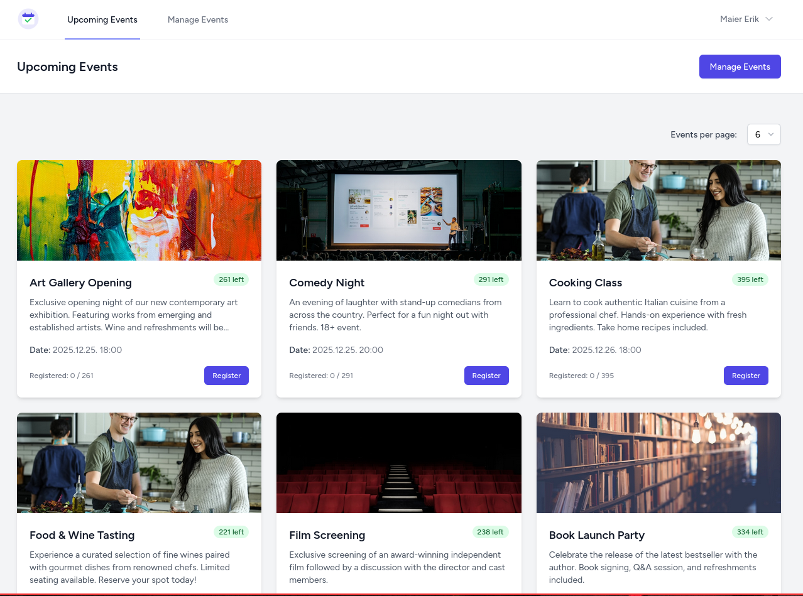
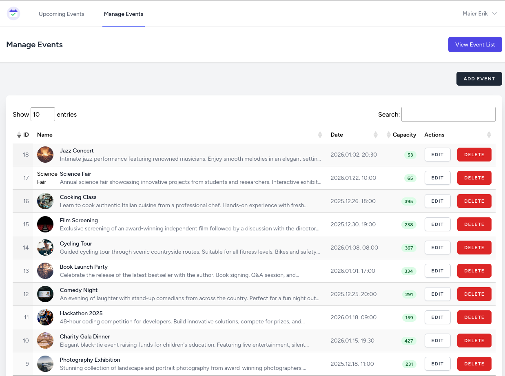
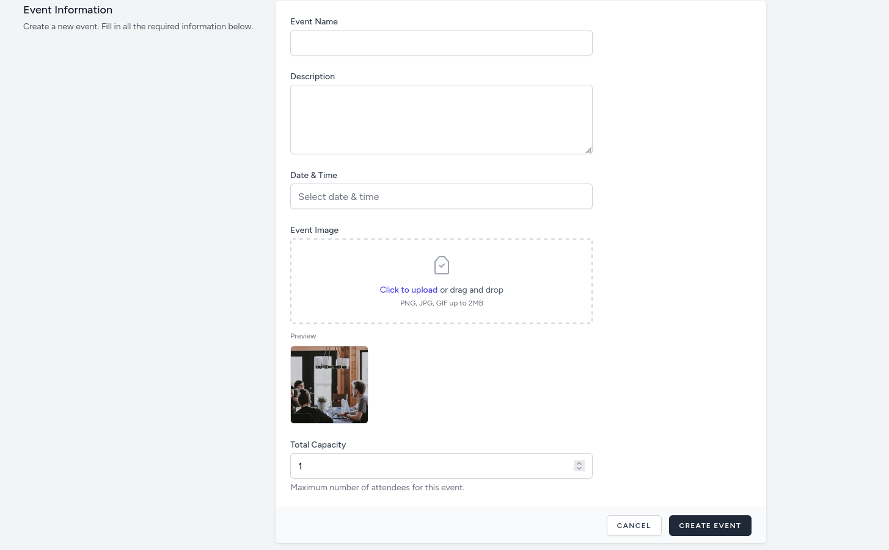

# Xtra App - Event Management System

A modern event management application built with Laravel 11, Inertia.js, and Vue 3. This application allows users to create, manage, and register for events with features like capacity management, email notifications, and race condition protection.

## Features

- **Event Management**: Create, edit, delete, and restore events
- **Event Registration**: Users can register for events with capacity limits
- **Email Notifications**: Automatic email confirmations for registrations
- **User Authentication**: Secure authentication using Laravel Jetstream
- **Responsive Design**: Modern UI built with Tailwind CSS
- **Image Upload**: Support for event images
- **Soft Deletes**: Events can be deleted and restored

## Screenshots

### Events List Page


### Event Management


### Event Details


## Tech Stack

- **Backend**: Laravel 11
- **Frontend**: Vue 3 with Inertia.js
- **Authentication**: Laravel Jetstream with Fortify
- **Database**: SQLite (default) or MariaDB (with Docker)
- **Styling**: Tailwind CSS
- **Build Tool**: Vite
- **Email**: Laravel Mail (with Mailpit for development)

## Requirements

- PHP 8.2 or higher
- Composer
- Node.js 18+ and npm
- Docker (for containerized setup)

## Installation

### Docker Setup (Laravel Sail)

1. **Clone the repository**
   ```bash
   git clone https://github.com/rkmaier/xtra-events
   cd xtra-app
   ```

2. **Install dependencies**
   ```bash
   composer install
   npm install
   ```

3. **Set up environment file**
   ```bash
   cp .env.example .env
   ```

4. **Configure Docker environment**
   
   Update your `.env` file with Docker settings:
   ```env
   DB_CONNECTION=mariadb
   DB_HOST=mariadb
   DB_PORT=3306
   DB_DATABASE=laravel
   DB_USERNAME=sail
   DB_PASSWORD=password
   ```

5. **Start Docker containers**
   ```bash
   ./vendor/bin/sail up -d
   ```

6. **Generate application key**
   ```bash
   ./vendor/bin/sail artisan key:generate
   ```

7. **Run migrations**
   ```bash
   ./vendor/bin/sail artisan migrate
   ```

8. **Build frontend assets**
   ```bash
   ./vendor/bin/sail npm run build
   ```
   
   Or for development:
   ```bash
   ./vendor/bin/sail npm run dev
   ```

   The application will be available at `http://localhost` (or the port specified in `APP_PORT`)

## Usage

### Creating an Account

1. Navigate to the registration page
2. Fill in your name, email, and password
3. Accept the terms of service and privacy policy
4. Click "Register"

### Creating an Event

1. Log in to your account
2. Click "Manage Events" in the navigation
3. Click "Add Event"
4. Fill in the event details:
   - **Event Name**: Name of the event (minimum 5 characters)
   - **Description**: Detailed description (maximum 5000 characters)
   - **Date & Time**: When the event will occur
   - **Event Image**: Optional image for the event
   - **Total Capacity**: Maximum number of attendees (minimum 1)
5. Click "Create Event"

### Registering for an Event

1. Browse events on the home page
2. Click "Register" on any available event
3. You'll receive a confirmation email with event details
4. The event creator will also receive a notification email

### Managing Your Events

1. Navigate to "Manage Events"
2. View all your created events in a data table
3. Edit events by clicking the edit button
4. Delete events (they can be restored later)
5. Restore deleted events if needed

### Event Capacity

- Events can have a capacity limit or be unlimited
- When an event reaches capacity, it shows as "Full"
- The system prevents overbooking using database-level locking
- Users cannot register for events they're already registered for

## Development

### Running Tests

```bash
php artisan test
```

Or with Docker:
```bash
./vendor/bin/sail artisan test
```

### Code Style

The project uses Laravel Pint for code formatting:

```bash
./vendor/bin/pint
```

### Development Workflow

For a complete development environment with hot reload:

```bash
composer dev
```

This command runs:
- Laravel development server
- Queue worker
- Laravel Pail (logs)
- Vite dev server

### Database Seeding

Seed the database with sample events:

```bash
php artisan db:seed --class=EventSeeder
```

## Email Configuration

### Development (Mailpit)

When using Docker, Mailpit is included and available at:
- SMTP: `localhost:1025`
- Web UI: `http://localhost:8025`

### Production

Update your `.env` file with your mail provider settings or by default you can use mailpit for testing:

```env
MAIL_MAILER=smtp
MAIL_HOST=mailpit
MAIL_PORT=1025
MAIL_USERNAME=null
MAIL_PASSWORD=null
MAIL_ENCRYPTION=null
MAIL_FROM_ADDRESS="xtra@info.com"
MAIL_FROM_NAME="${APP_NAME}"
```


